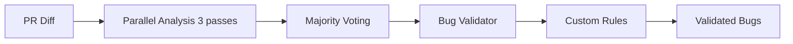

# Claude Code BugHunter

A self-hosted GitHub PR bug detection agent powered by [Claude Code](https://docs.anthropic.com/en/docs/claude-code).

Monitors open pull requests for new commits, analyzes diffs for potential bugs using Claude Code, posts review comments with findings, generates fixes on dedicated branches, and pushes approved fixes to the PR branch on user command.

## Features

- **Automatic PR monitoring**: Polls GitHub for open PRs across configured organizations/repositories
- **Bug detection**: Analyzes PR diffs using `claude -p` for bugs, security issues, and code quality problems
- **Parallel analysis with majority voting**: Runs multiple analysis passes and filters bugs via majority voting (inspired by Cursor Bugbot)
- **Bug validation**: Second-pass validation to reduce false positives
- **Agentic analysis mode**: Deep investigation using tools (Read, Grep, Glob) for suspicious patterns
- **Dynamic context discovery**: Token-efficient on-demand context loading
- **Custom rules support**: Project-specific bug detection rules via `BUGHUNTER.md`
- **PR summary updates**: Automatically updates PR description with risk assessment and change overview
- **Inline review comments**: Posts structured bug findings as PR review comments with severity levels
- **Autofix generation**: Generates bug fixes using Claude Code, committed to dedicated branches
- **Approval workflow**: Users approve fixes via `/bughunter push <sha>` comments; fixes are merged to the PR branch

## Prerequisites

- **`gh` CLI**: Authenticated with GitHub (`gh auth status`)
- **`claude` CLI**: Authenticated Claude Code (`claude --version`)
- **`git`**: For repository operations
- **Node.js** >= 18.0.0 (for local installation) or **Docker** (for containerized deployment)

## Authentication Setup

BugHunter requires authentication for both GitHub and Claude Code. The setup differs by platform.

### GitHub Authentication (`gh` CLI)

| Environment             | Method                                                                                          |
| ----------------------- | ----------------------------------------------------------------------------------------------- |
| **Local (Linux/macOS)** | Run `gh auth login` — the token is stored in `~/.config/gh/hosts.yml` (Linux) or macOS Keychain |
| **Docker on Linux**     | Auto-mounted via `docker-compose.yml` volume (`~/.config/gh:/root/.config/gh:ro`)               |
| **Docker on macOS**     | Set `GH_TOKEN` in `.env` (macOS Keychain is inaccessible from containers)                       |

To obtain `GH_TOKEN`:

```bash
gh auth token
```

### Claude Code Authentication

Claude Code supports two authentication methods:

#### Option 1: OAuth Token (`CLAUDE_CODE_OAUTH_TOKEN`) — for Pro/Max/Team plan

This uses your Claude Pro/Max/Team subscription. The token is valid for approximately 1 year.

**How to generate the token:**

```bash
claude setup-token
```

This command outputs a long-lived OAuth token. Copy and set it:

| Environment         | Method                                                                                    |
| ------------------- | ----------------------------------------------------------------------------------------- |
| **Local (Linux)**   | Not needed — credentials are stored in `~/.claude/.credentials.json` after `claude login` |
| **Local (macOS)**   | Not needed — credentials are stored in macOS Keychain after `claude login`                |
| **Docker on Linux** | Auto-mounted via `docker-compose.yml` volume (`~/.claude:/root/.claude`)                  |
| **Docker on macOS** | Set `CLAUDE_CODE_OAUTH_TOKEN` in `.env` (macOS Keychain is inaccessible from containers)  |

#### Option 2: API Key (`ANTHROPIC_API_KEY`) — for pay-as-you-go billing

This uses the Anthropic API directly with pay-as-you-go billing.

1. Create an API key at [console.anthropic.com](https://console.anthropic.com/)
2. Set `ANTHROPIC_API_KEY` in `.env` or as an environment variable

> **Note**: API key authentication works the same way on all platforms (local and Docker).

## Quick Start

### Local Installation

```bash
# Clone the repository
git clone https://github.com/Senna46/claude-code-bughunter.git
cd claude-code-bughunter

# Install dependencies
npm install

# Configure environment
cp .env.example .env
# Edit .env with your settings (see Configuration section)

# Build and run
npm run build
npm start

# Or run in development mode
npm run dev
```

### Docker

```bash
# Clone and configure
git clone https://github.com/Senna46/claude-code-bughunter.git
cd claude-code-bughunter
cp .env.example .env
# Edit .env with your settings (see Configuration section)

# First-time setup: Create claude.json if it doesn't exist
# (Prevents Docker from creating it as a directory)
touch ~/.claude.json

# macOS only: Add authentication tokens to .env
# gh auth token            → set GH_TOKEN in .env
# claude setup-token       → set CLAUDE_CODE_OAUTH_TOKEN in .env

# Build and start
docker compose build
docker compose up -d

# View logs
docker compose logs -f
```

## Configuration

Copy `.env.example` to `.env` and configure:

### Target Repositories

| Variable                 | Required | Default | Description                                               |
| ------------------------ | -------- | ------- | --------------------------------------------------------- |
| `BUGHUNTER_GITHUB_ORGS`  | Yes\*    | -       | GitHub owners to monitor: users or orgs (comma-separated) |
| `BUGHUNTER_GITHUB_REPOS` | Yes\*    | -       | Specific repos to monitor (`owner/repo`, comma-separated) |

\* At least one of `BUGHUNTER_GITHUB_ORGS` or `BUGHUNTER_GITHUB_REPOS` must be set.

### Behavior

| Variable | Required | Default | Description |
|----------|----------|---------|-------------|
| `BUGHUNTER_POLL_INTERVAL` | No | `60` | Polling interval in seconds |
| `BUGHUNTER_BOT_NAME` | No | `bughunter` | Bot name for approval commands |
| `BUGHUNTER_AUTOFIX_MODE` | No | `branch` | Autofix mode: `off`, `branch`, `commit`, `pr` |
| `BUGHUNTER_WORK_DIR` | No | `~/.bughunter/repos` | Directory for cloning repositories |
| `BUGHUNTER_MAX_DIFF_SIZE` | No | `100000` | Max diff size (chars) to analyze |
| `BUGHUNTER_MAX_FILE_CONTEXT_SIZE` | No | `200000` | Max file context size (chars) |
| `BUGHUNTER_CLAUDE_MODEL` | No | CLI default | Claude model to use |
| `BUGHUNTER_LOG_LEVEL` | No | `info` | Log level (debug/info/warn/error) |
| `BUGHUNTER_DB_PATH` | No | `~/.bughunter/state.db` | SQLite database path |

### Analysis Performance (inspired by Cursor Bugbot)

| Variable | Required | Default | Description |
|----------|----------|---------|-------------|
| `BUGHUNTER_ANALYSIS_PASSES` | No | `3` | Number of parallel analysis passes |
| `BUGHUNTER_VOTE_THRESHOLD` | No | `2` | Minimum votes for a bug to be reported |
| `BUGHUNTER_ENABLE_VALIDATOR` | No | `true` | Enable bug validation step |
| `BUGHUNTER_VALIDATOR_MODEL` | No | - | Model to use for validation (default: same as analysis) |

### Advanced Features

| Variable | Required | Default | Description |
|----------|----------|---------|-------------|
| `BUGHUNTER_ENABLE_AGENTIC` | No | `false` | Enable agentic analysis for deep investigation |
| `BUGHUNTER_AGENTIC_MAX_TURNS` | No | `10` | Max turns for agentic analysis |
| `BUGHUNTER_ENABLE_DYNAMIC_CONTEXT` | No | `true` | Enable dynamic context discovery |
| `BUGHUNTER_DYNAMIC_CONTEXT_MAX_FILES` | No | `10` | Max files to load dynamically |
| `BUGHUNTER_DYNAMIC_CONTEXT_MAX_LINES` | No | `500` | Max lines per file |
| `BUGHUNTER_CUSTOM_RULES_PATH` | No | - | Path to custom rules file (default: `BUGHUNTER.md`) |

### Authentication (Docker / Environment Variables)

| Variable                  | Required          | Description                                 |
| ------------------------- | ----------------- | ------------------------------------------- |
| `GH_TOKEN`                | macOS Docker only | GitHub token (`gh auth token`)              |
| `CLAUDE_CODE_OAUTH_TOKEN` | macOS Docker only | Claude OAuth token (`claude setup-token`)   |
| `ANTHROPIC_API_KEY`       | Alternative       | Anthropic API key for pay-as-you-go billing |

> **Note**: On Linux, file-based authentication works automatically via volume mounts in `docker-compose.yml`. You only need to set environment variables when running Docker on macOS (where credentials are stored in Keychain).

## Workflow

```
1. Poll GitHub for open PRs
2. Detect new commits since last analysis
3. Analyze diff with Claude Code → structured bug report
4. Update PR body with summary (risk level, overview)
5. Post inline review comments for each bug
6. Generate fixes via Claude Code in cloned repo
7. Create fix branch, commit, push
8. Post autofix comment with diff preview and push command
9. Wait for user approval: /bughunter push <sha>
10. Cherry-pick approved fix to PR branch
11. Repeat
```

## Running as a Service

### Docker (recommended)

Use `restart: unless-stopped` in `docker-compose.yml` (already configured) to run as a daemon:

```bash
docker compose up -d
```

**Management commands:**

```bash
# Check status
docker compose ps

# View logs
docker compose logs -f

# Restart
docker compose restart

# Stop
docker compose down

# Remove with data
docker compose down -v
```

> The container persists state and cloned repos in a named volume `bughunter-data`.

## Custom Rules

BugHunter supports project-specific bug detection rules via a `BUGHUNTER.md` file. Place this file in your repository root or `.bughunter/` directory.

### Example BUGHUNTER.md

```markdown
## Rule: No direct database queries in API handlers
- severity: high
- pattern: db\.query\(
- filePattern: api/.*\.ts
- checkType: must-not-contain

All database queries must go through the repository layer.

## Rule: Require input validation
- severity: medium
- pattern: \.validate\(
- filePattern: api/.*\.ts
- checkType: must-contain

All API handlers must validate input with Zod.

## Rule: No any type
- severity: low
- pattern: :\s*any
- checkType: must-not-contain

Avoid using the any type in TypeScript code.
```

### Default Rules

BugHunter includes several default rules:

- **Potential SQL Injection**: String concatenation in SQL queries
- **Dangerous eval() Usage**: Using eval() with user input
- **Potential Hardcoded Secret**: API keys, passwords in source code
- **Explicit 'any' Type Usage**: Using TypeScript's `any` type
- **Console.log in Production Code**: Debug console statements

## Architecture

BugHunter's analysis pipeline is inspired by Cursor Bugbot's approach:



1. **Parallel Analysis**: Multiple passes with randomized diff ordering for diverse reasoning
2. **Majority Voting**: Filter bugs that receive votes from multiple passes
3. **Bug Validator**: Second-pass validation to reduce false positives
4. **Custom Rules**: Project-specific checks from BUGHUNTER.md

### systemd (Linux/WSL2)

```bash
# Copy the service file
cp claude-code-bughunter.service ~/.config/systemd/user/

# Enable and start
systemctl --user enable claude-code-bughunter
systemctl --user start claude-code-bughunter

# Check status / logs
systemctl --user status claude-code-bughunter
journalctl --user -u claude-code-bughunter -f
```

### launchd (macOS)

```bash
cp com.claude-code-bughunter.plist ~/Library/LaunchAgents/
launchctl load ~/Library/LaunchAgents/com.claude-code-bughunter.plist
```

## License

MIT
